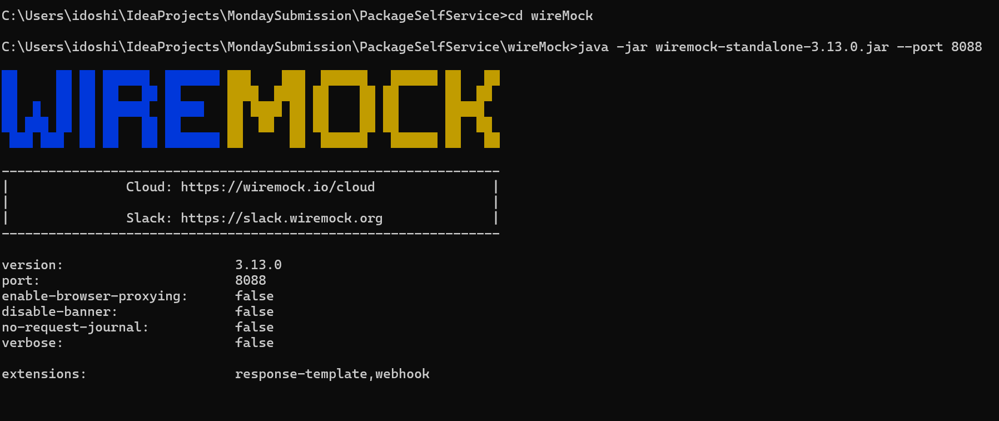
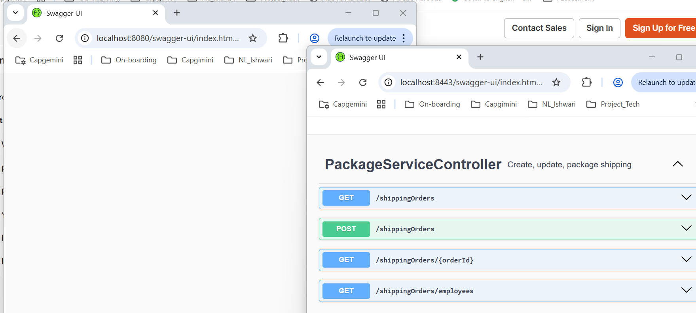
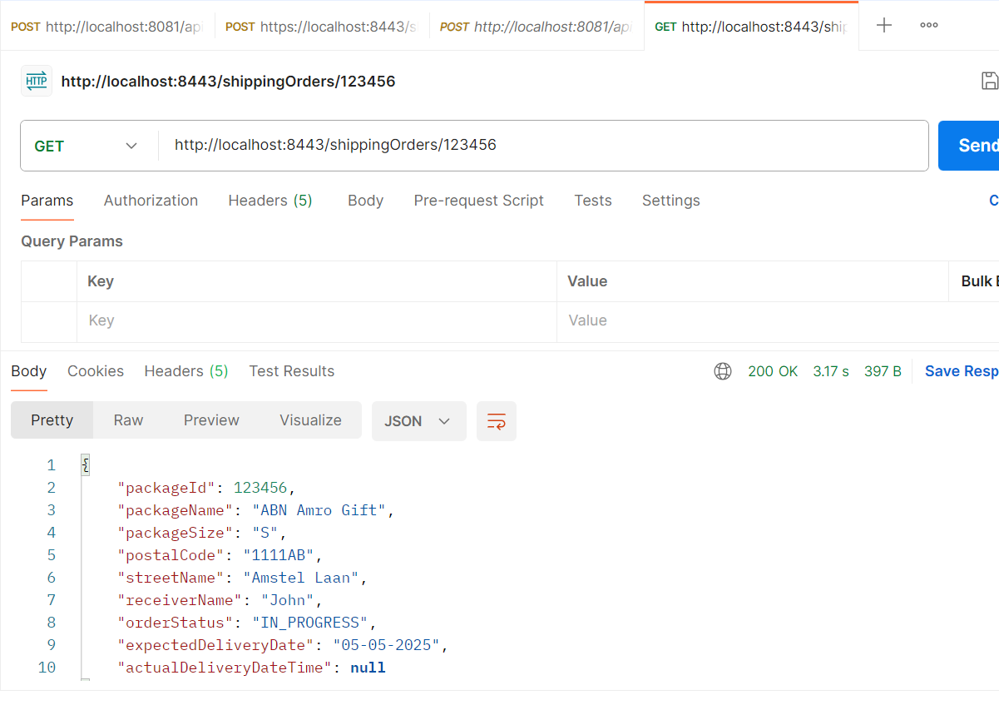

# PackageSelfService

Application has 2 parts 
1. The API for Package Self Service backend
2. A wiremock server and mappings to simulate the Package Order Service


Package Self service API
-----
## Running the application

This application has 2 parts service api and wiremock which stimulates the api

Clone the repository to your local

```
git clone https://github.com/Ishwari96/PackageSelfService.git

```
To tun the wiremock server follow the instructions:

First Go to wireMock package and run wiremock as per mentioned in below screen print


Go to root directory of the code. Run following command to run the application.

```
mvn clean install

```

Now the application is build to run. Use following command to run spring boot application on command prompt.

```
mvn spring-boot:run

```

Check shipping url service and application port is up and running i.e. 8443 and 8080 as per below screen print


```
Swagger or open feign client is enabled and you can find URL 

http://localhost:8443/swagger-ui/index.html#/



```

## In real time

- To implement the features you mentioned in real-time, we can break down the tasks into several steps:

   - 1. Java 21/24
      My local setup was alinged with Java 17 so decided to focus on requirement or delivery first
   
   - 2. Customizable User or Employee Details
      Database Setup: Use PostgreSQL for persistent data storage.
      Frontend Integration: Create a user interface for users to input and update their details.
      
   - 3. Database Configuration
      H2 Database used for Demo: for initial setup and testing.
      PostgreSQL for Production: we can configure PostgreSQL for production use to ensure data persistence.
      
   - 4. Docker Image Submission
      Dockerfile Creation: Write a Dockerfile to containerize the application.
      Docker Compose: Docker Compose to manage multi-container applications.
      Image Submission: Push the Docker image to a repository like Docker Hub.
    
   - 5. Clarification
      While implementing services had many questions, in real time first I could have discussed with PO or BA
      So that there is concreate decision with design
    
   - 6. Postman Changes
      To make collection production ready seperate collection and enviornment is added with DTAP URLs using variables

   - 7. Security Integration Services
      In order to make production ready application before merging it into master deploying it should scan via Nexus, fortify